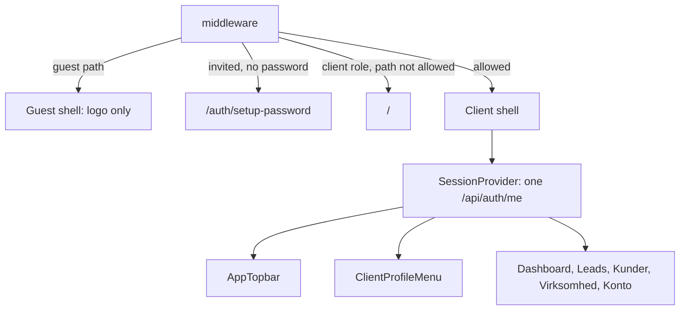
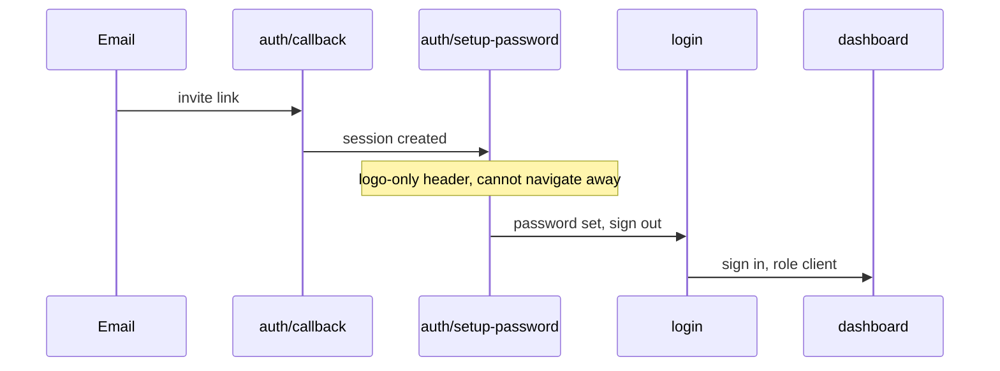

# Client portal UI guide

How the client-facing part of Censio CRM should work, what is broken today, and the order to fix it in. Read this before changing anything a client (`client_admin` or `client_user`) sees: the header, the profile dropdown, the auth pages, `/konto`, `/virksomhed`, or the client route rules in `middleware.ts`.

The Censio admin experience is out of scope and should keep working as it does now. The only rule that touches admin code: in shared components, decide between the admin branch and the client branch by **role**, never by URL.

This repo runs a newer Next.js than most training data. Read the relevant guide in `node_modules/next/dist/docs/` before using a Next.js API you are unsure about (see `AGENTS.md`). `middleware.ts` still uses the deprecated `middleware` convention; keep it as is, and leave the `proxy` migration for its own change.

---

## 1. What a client should see

| Area | Content |
|---|---|
| Header, left | Censio logo × client logo (client logo only if the organization has one) |
| Header, center | Dashboard (`/`), Leads (`/leads`), Kunder (`/kunder`) |
| Header, right | Language switcher (on dashboard pages), then the profile dropdown |
| Dropdown trigger | The user's own name and profile picture (initials if no picture) |
| Dropdown items | **Virksomhedsoplysninger** (`/virksomhed`), **Mine indstillinger** (`/konto`), separator, **Log ud** |
| Auth pages (`/login`, `/logget-ud`, `/auth/*`, `/tilmelding*`) | Censio logo only. No nav, no dropdown, no language switcher, no login link |

Nothing else is reachable for a client. Any other URL redirects (see section 4).

---

## 2. What is broken today

Each item names the file and the reason, so the fix lands in the right place.

1. **Auth pages show the app chrome.** `components/layout/AppTopbar.tsx` hides the nav on guest paths but always renders `<ProfileMenu />`. On `/auth/setup-password` the invited user already has a session (created by `app/auth/callback/page.tsx`), so the whole client dropdown appears (Indstillinger, Onboarding, Kontakt, Min konto). The user can leave the page before setting a password. On `/login` a signed-out visitor sees a redundant "Log ind" link.
2. **No guard for half-onboarded users.** `middleware.ts` lets any signed-in user through on `/auth/setup-password` and only gates `/admin` and `/klienter`. An invited user who has not set a password can open `/`, `/leads`, and so on.
3. **No client route allowlist.** Clients can open `/indstillinger`, `/onboarding`, `/kontakt`, `/overblik`, and `/lead-performance` by typing the URL.
4. **Demo data shown as if it were real.** `lib/account-settings.ts` keeps client "settings" in localStorage, seeded with demo values from `lib/company.ts`:
   - Profile picture: defaults to `/company-avatar.jpg`. This is the stock image every client sees in the header.
   - Display name: read from localStorage, not from `profiles.full_name`.
   - `hvidbjergPartner` defaults to `true`, so every client sees the Hvidbjerg "certified" badge on the dashboard and overview.
   - `CURRENT_COMPANY.name` ("Nordkystens Tømrer") is used as a fallback name in `components/performance/DashboardHeader.tsx` (the "Velkommen, …" line uses it unconditionally), `components/overview/OverviewBoard.tsx`, `components/layout/ProfileMenu.tsx`, `components/layout/AppTopbar.tsx`, `components/account/SettingsBoard.tsx`, and `app/onboarding/page.tsx`.
5. **Fake forms.** The password forms in `components/account/MinKontoBoard.tsx` and `components/account/SettingsBoard.tsx` validate the input and then show "Koden er opdateret" without calling Supabase. The "Giv adgang til en medarbejder" list in `SettingsBoard.tsx` only writes to localStorage and invites nobody.
6. **Session state is duplicated.** `hooks/useActiveOrganization.ts` holds its own `useState` in every component that calls it (about 15 of them: header, dropdown, frame, settings, and more). Each one fetches `/api/auth/me` separately, and `useUserProfile` fetches it again. When a user saves a logo or company name, only the component that saved it reloads; the header keeps its old copy until a full page refresh.

---

## 3. Target architecture



### 3a. One session source

Add `components/session/SessionProvider.tsx` and mount it in `components/layout/AppShell.tsx`, inside `LanguageProvider` and outside `AppFrame`.

- It fetches `/api/auth/me` once when the Supabase session is known (use `useSupabaseSession` for that), and again only when `reload()` is called or the auth state changes (sign in, sign out, user switch).
- Context value:

```ts
type SessionContextValue = {
  user: { id: string; email: string | null; fullName: string | null; avatarUrl: string | null } | null
  role: UserRole | null
  organization: ActiveOrganization | null // includes logoUrl and profileComplete
  isAdminViewingClient: boolean
  needsClientSelection: boolean
  loading: boolean
  reload: () => Promise<void>
  setActiveOrganization: (slug: string | null) => Promise<boolean>
}
```

- Move the existing logic of `useActiveOrganization` (the fetch, `setActiveOrganization` via `POST /api/admin/active-organization`, `clearClientCaches`, `emitClientOrgChanged`) into the provider.
- Rewrite `hooks/useActiveOrganization.ts` and `lib/auth/use-user-profile.ts` as thin readers of the context. **Keep their return shapes exactly as they are**, so no call site has to change.
- `/api/auth/me` already returns `email`, `fullName`, `avatarUrl`, `role`, and `organization` (with `logoUrl` and `profileComplete`). No API change is needed for this step.
- Every save that changes something the header shows (logo, company name, the user's own name or picture) must call `reload()` afterwards.

### 3b. Route policy in one place

Add `lib/layout/client-routes.ts` and use it from both `middleware.ts` and the header:

```ts
export const CLIENT_ALLOWED_PATHS = ["/", "/leads", "/kunder", "/virksomhed", "/konto"] as const

export function isClientAllowedPath(pathname: string): boolean
// "/" matches exactly; the others match the path and any subpath.

export const CLIENT_LEGACY_REDIRECTS: Record<string, string> = {
  "/indstillinger": "/virksomhed",
  "/onboarding": "/",
  "/kontakt": "/",
  "/overblik": "/",
  "/lead-performance": "/",
}
```

Guest paths stay in `lib/layout/app-paths.ts` (`isGuestShellPath`); reuse that, do not duplicate it.

Update `isClientDashboardPath` in `lib/layout/app-paths.ts` to include `/virksomhed` and `/konto`, so those pages get the client shell (dashboard background, nav, client logo).

### 3c. Middleware rules, in this order

`middleware.ts` already calls `supabase.auth.getUser()` once. Add the rules after that call:

1. **Signed in and on `/login`:** redirect to `/klienter` (admin) or `/` (client). This already exists; keep it.
2. **Password not set yet:** if `user.invited_at` is set and `user.user_metadata?.password_setup_complete !== true`, and the path is not a guest path and not `/api/*`, redirect to `/auth/setup-password`. The `invited_at` check matters: users that an admin created with a password (the "password" invite method) never get the flag, and must not be trapped. `SetupPasswordForm` already sets `password_setup_complete: true` when the password is saved.
3. **Signed-in client on a path that is not allowed:** if the path is not a guest path, not `/api/*`, not under `/admin` or `/klienter` (those keep their current admin gate), and `isClientAllowedPath` is false, then load the role from `profiles`. If the role is not `censio_admin`, redirect to the target in `CLIENT_LEGACY_REDIRECTS`, or `/` if there is none. Only disallowed paths run this query, so normal client navigation adds no database round trip.
4. **Admin gate for `/admin` and `/klienter`:** unchanged.

Admins viewing a client dashboard (the `crm_active_org_slug` cookie, `ACTIVE_ORG_COOKIE` in `lib/auth/active-organization.ts`) keep access to every page, including the legacy ones, because rule 3 skips `censio_admin`.

### 3d. Header rules (`components/layout/AppTopbar.tsx`)

| State | Left | Center | Right |
|---|---|---|---|
| Guest path | Censio logo only (links to `/login`) | none | nothing |
| Session loading | Censio logo | none | round avatar skeleton |
| Client signed in | Censio logo × client logo (only if `organization.logoUrl`) | Dashboard, Leads, Kunder | language switcher on dashboard pages, then `ClientProfileMenu` |
| Censio admin | unchanged | unchanged | `AdminProfileMenu` (today's admin branch) |

- On guest paths, do not render the profile menu at all. That removes both the leaked dropdown on `/auth/setup-password` and the "Log ind" link on `/login`.
- Never fall back to `CURRENT_COMPANY`. While the session loads, show a skeleton. If a client has no organization (should not happen, but can during data repair), show the Censio logo only.
- `aria-label` on the home link: `Censio × {organization name}` when the client logo shows, otherwise `Censio`.

### 3e. Profile dropdown

Split `components/layout/ProfileMenu.tsx` into two components in `components/layout/`:

- `AdminProfileMenu.tsx`: today's admin branch, moved as is (Klient-dashboard, Klientopsætning, Workspace-indstillinger, Meta & klienter-hub, Min konto, Log ud). Do not change its items in this work.
- `ClientProfileMenu.tsx`: new, described below.

`ProfileMenu.tsx` becomes a small switch that picks one of the two by `role` from the session context, and renders the avatar skeleton while loading.

`ClientProfileMenu`:

- **Trigger:** the name (`user.fullName`, or the part of `user.email` before `@` when the name is empty), then the avatar.
- **Avatar:** `user.avatarUrl` when set. Otherwise a circle with the user's initials (reuse `clientInitialsFromName` from `lib/admin/format-client-display-name.ts`). Never a stock image.
- **Menu header:** avatar, full name, and email on two lines.
- **Items, and nothing else:**
  1. **Virksomhedsoplysninger** (`Building2Icon`) links to `/virksomhed`.
  2. **Mine indstillinger** (`UserRoundIcon`) links to `/konto`.
  3. Separator.
  4. **Log ud** (`LogOutIcon`, destructive variant): `await createClient().auth.signOut()`, then `clearClientCaches()` from `lib/data/client-cache.ts`, then `router.replace("/logget-ud")`.
- Add i18n keys to both `lib/i18n/locales/da.ts` and `lib/i18n/locales/en.ts`, for example `clientMenuCompanyDetails` ("Virksomhedsoplysninger" / "Company details") and `clientMenuMySettings` ("Mine indstillinger" / "My settings"). Reuse `profileMenuSignOut` for Log ud.

### 3f. Pages

#### `/virksomhed`: Company details

New `app/virksomhed/page.tsx` that renders a `CompanyDetailsBoard` (new, in `components/account/`).

- Page title "Virksomhedsoplysninger" and one line of description.
- Body: `components/organization/OrganizationCompanyProfileSection.tsx`, which already contains the logo upload (`POST/DELETE /api/organization/logo`) and the company and contact fields (`GET/PATCH /api/organization/profile`).
- `client_admin` can edit. `client_user` sees the same fields read-only, with no save or upload buttons. The section already checks the role; verify that `client_user` gets the read-only path, and pass `canEdit={false}` to the logo upload in that case.
- When the profile is incomplete, show `OrganizationProfileIncompleteBanner` above the form, and change that banner's client link from `/indstillinger#company-profile` to `/virksomhed`.
- After a successful save or logo change, call `reload()` from the session context so the header logo and name update without a refresh.

#### `/konto`: My settings

Rework `components/account/MinKontoBoard.tsx`. Keep `app/konto/page.tsx` and `KontoPageGate` (it already sends admins to `/admin/konto`).

Cards, in this order:

1. **Navn.** Text input with the current `user.fullName`. Saves through the new API below.
2. **Profilbillede.** Reuse `components/account/ProfilePhotoField.tsx`. Saves through the new API below. Include a remove option.
3. **Login-e-mail.** Read-only `user.email`, with a note that it is the personal login, not the company contact email. Keep the existing i18n keys `workspaceLoginEmailTitle` and `workspaceLoginEmailDescription`.
4. **Adgangskode.** A real password change (see below).
5. **Sprog.** Danish or English. Saves through the existing `PATCH /api/account/locale` and updates `LanguageProvider`. The header language switcher can stay.

New API `app/api/account/profile/route.ts`:

- `GET` returns `{ fullName, avatarUrl, email }` for the signed-in user.
- `PATCH` accepts `{ fullName?: string, avatarUrl?: string | null }`.
- Auth: `getSessionContext()`. Return 401 without `ctx.userId`. Only ever update the caller's own row (`ctx.userId`); never take a user id from the request body.
- Validate the avatar the same way as `app/api/admin/me/profile/route.ts`: data URLs starting with `data:image/` only, 2 MB max, empty string or `null` clears it. Write with `lib/db/update-profile-avatar.ts`.
- `fullName`: trim; reject an empty name with 400; maximum 120 characters. Update `profiles.full_name` with the admin client after the auth check, like the admin route does.
- After a successful save, the board calls `reload()`, so the dropdown trigger shows the new name and picture.

Real password change, in the board (browser Supabase client):

1. Require the current password, a new password of at least 8 characters, and a matching confirmation (reuse `MatchingPasswordFields` from `components/auth/`).
2. Re-authenticate: `supabase.auth.signInWithPassword({ email: user.email, password: current })`. On error, show "Den nuværende kode er forkert" and stop.
3. `supabase.auth.updateUser({ password: next })`. Show the real Supabase error message if it fails.
4. On success, clear the three fields and show the success notice.

#### Dashboard welcome line

In `components/performance/DashboardHeader.tsx`, use the session organization:

```tsx
const { organization } = useActiveOrganization()
// ...
{organization
  ? t("dashboardWelcome", { name: formatClientDisplayName(organization.name) })
  : <span className="inline-block h-9 w-64 animate-pulse rounded-md bg-muted" aria-hidden="true" />}
```

Do the same in `components/overview/OverviewBoard.tsx`: drop the `CURRENT_COMPANY` fallback, and show the skeleton until the organization is known.

#### Remove or retire

- `components/account/SettingsBoard.tsx` and `app/indstillinger/page.tsx`: the middleware now redirects `/indstillinger` to `/virksomhed`. Make the page a server-side `redirect("/virksomhed")` as a backup, and delete `SettingsBoard.tsx` (fake password, demo employee list, duplicate email card, demo logo).
- `lib/account-settings.ts` and `AccountSettingsProvider`: stop using them for the client name, picture, logo, email, and employees. Use `hvidbjergPartner` only if a real organization-level flag exists; until then, hide the badge (remove the default `true`, or remove the badge blocks in `DashboardHeader.tsx` and `OverviewBoard.tsx`). If nothing else reads the provider after this, remove it from `AppShell`.
- `CURRENT_COMPANY` in client components: remove every use listed in section 2. `lib/company.ts` can stay for the unauthenticated demo mode if something still needs it; nothing a signed-in client sees may read it.
- `app/onboarding/page.tsx` and `app/kontakt/page.tsx`: unreachable for clients after the middleware change. Leave the files; remove their links from the client UI.

---

## 4. Invite and login flow



What must hold:

- On `/auth/callback`, `/auth/setup-password`, `/auth/invite`, `/login`, and `/logget-ud` the header shows the Censio logo only: no dropdown, no nav, no language switcher.
- While the password is not set, typing `/`, `/leads`, or `/konto` sends the user back to `/auth/setup-password` (middleware rule 2).
- After setting the password, `SetupPasswordForm` signs out and opens `/login?message=account_ready` (already the case).
- After login, a client lands on `/` and an admin on `/klienter` (already the case in `LoginForm.tsx`).

---

## 5. Work order

Each step is a separate PR that can be tested on its own. Do them in this order; later steps rely on the session provider.

1. **Session provider.** Add `SessionProvider` and swap the internals of `useActiveOrganization` and `useUserProfile`. Check: nothing looks different, and the Network tab shows one `/api/auth/me` request per page load instead of many.
2. **Header and guest shell.** Hide the profile menu on guest paths. Remove the `CURRENT_COMPANY` fallbacks. Use the real company name in the dashboard welcome line and on the overview. Hide the Hvidbjerg badge.
3. **Middleware.** Add `lib/layout/client-routes.ts`, the password-setup gate, the client allowlist, and the legacy redirects. Add `/virksomhed` and `/konto` to `isClientDashboardPath`.
4. **Client dropdown.** Split `ProfileMenu` into `ClientProfileMenu` and `AdminProfileMenu`. The client menu has exactly the three items.
5. **`/virksomhed`.** New page with the company section, read-only for `client_user`, and the banner link change.
6. **`/konto`.** Add `/api/account/profile`, rework `MinKontoBoard` with real name, picture, password, and language saves.
7. **Cleanup.** Delete `SettingsBoard.tsx`, make `/indstillinger` a redirect, drop unused localStorage fields and the provider if nothing uses them.

After each step run `npm run test -- --run` and `npm run build`.

---

## 6. Manual test checklist

Run this on `http://localhost:3000` with a real client account (`client_admin`) and a second one (`client_user`) in the same organization.

- [ ] New invite: open the email link. The setup page shows the Censio logo only. Go to `/` by hand: you are sent back to setup. Set the password, log in, land on `/`.
- [ ] `/login` while signed out: Censio logo only, no "Log ind" link in the header.
- [ ] Client admin dropdown: exactly Virksomhedsoplysninger, Mine indstillinger, Log ud. The trigger shows your real name and your uploaded picture, or your initials.
- [ ] Dashboard: "Velkommen, {real company name}". No Hvidbjerg badge.
- [ ] Upload a logo on `/virksomhed`: the header logo changes without a page refresh. Remove it: the client logo and the × disappear.
- [ ] Change the company name on `/virksomhed`: the welcome line and the logo `aria-label` follow.
- [ ] `/konto`: change your name and picture; the dropdown trigger updates. Change your password, log out, log in with the new password.
- [ ] `client_user`: `/virksomhed` is read-only (no save, no logo buttons).
- [ ] As a client, open `/indstillinger` (goes to `/virksomhed`), and `/onboarding`, `/kontakt`, `/overblik`, `/admin`, `/klienter` (all go to `/`).
- [ ] As a Censio admin viewing a client dashboard: the admin dropdown is unchanged, and Dashboard, Leads, and Kunder still work.
- [ ] Log ud: lands on `/logget-ud`, and the browser back button does not show client data.

---

## 7. Later improvements

Not part of the work above; pick them up once the core is stable.

- Empty-state dashboard for new clients without leads, with a short "what happens next" (Meta connection, contact Censio).
- A first-login welcome card that points to Virksomhedsoplysninger while `organization.profileComplete` is false.
- Mobile header: below `md`, move Dashboard, Leads, and Kunder into a bottom bar or a compact menu, so the logo and dropdown never wrap.
- Browser tab titles with the company name, for example "Leads – Murermester".
